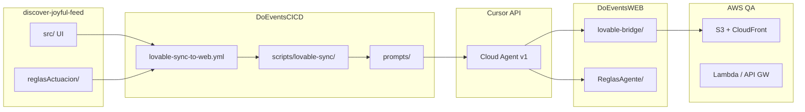

# DoEventsCICD — Documentación técnica

Repositorio central de **orquestación CI/CD** para el ecosistema Do.Events: sincronización **Lovable → Cursor Agent → DoEventsWEB/Back → AWS QA**, con gobernanza por `reglasActuacion`, `ReglasAgente` y políticas del agente.

**Arquitectura de referencia:** `docs/ARQUITECTURA.md` (basada en `Automatizacion.html`)  
**Reglamento del agente:** `prompts/REGLAS_CURSOR_API_LOVABLE_DOEVENTSWEB.md`

---

## Tabla de contenidos

1. [Objetivo](#1-objetivo)
2. [Repositorios del ecosistema](#2-repositorios-del-ecosistema)
3. [Arquitectura del pipeline](#3-arquitectura-del-pipeline)
4. [Estructura de este repo](#4-estructura-de-este-repo)
5. [Workflows GitHub Actions](#5-workflows-github-actions)
6. [Scripts principales](#6-scripts-principales)
7. [Agente Cursor API](#7-agente-cursor-api)
8. [Bootstrap para el equipo](#8-bootstrap-para-el-equipo)
9. [Secretos y permisos](#9-secretos-y-permisos)
10. [Despliegue AWS QA](#10-despliegue-aws-qa)
11. [Integración con discover-joyful-feed](#11-integración-con-discover-joyful-feed)
12. [Roadmap de fases](#12-roadmap-de-fases)

---

## 1. Objetivo

Automatizar de forma **controlada** (human-in-the-loop):

1. Detectar cambios de diseño en Lovable (`discover-joyful-feed`)
2. Validar `reglasActuacion/` (YAML)
3. Preparar artefactos en `DoEventsWEB/ReglasAgente/`
4. Invocar **Cursor Cloud Agents API** para adaptar código (sin copia literal, sin mocks)
5. Opcionalmente desplegar a **QA** en AWS

La IA **no** despliega a producción ni modifica secretos.

---

## 2. Repositorios del ecossistema

| Repositorio | GitHub | Rama trabajo |
|-------------|--------|--------------|
| Diseño Lovable | [discover-joyful-feed](https://github.com/doeventsrepo/discover-joyful-feed) | `main` |
| Frontend | [DoEventsWEB](https://github.com/doeventsrepo/DoEventsWEB) | `develop` |
| Backend | [DoEventsBack](https://github.com/doeventsrepo/DoEventsBack) | `develop` |
| IA runtime | [DoEventsIA](https://github.com/doeventsrepo/DoEventsIA) | `develop` |
| **CI/CD (este repo)** | `doeventsrepo/DoEventsCICD` | `main` |

Configuración central: `cicd.config.json`

---

## 3. Arquitectura del pipeline



### Flujo de ramas

```text
Lovable main → DoEventsCICD sync → feature/lovable/adapt-{sha} → PR → develop → deploy QA
```

---

## 4. Estructura de este repo

```text
DoEventsCICD/
├── .github/workflows/          # Pipelines reutilizables
├── scripts/
│   ├── lovable-sync/           # Python: diff, contexto, agente, validación
│   └── deploy/                 # Bash: deploy WEB QA
├── prompts/                    # Prompts Cursor + reglamento operativo
├── policies/                   # Permisos del agente (.ai-policy)
├── templates/
│   ├── ReglasAgente/           # Bootstrap DoEventsWEB
│   ├── .lovable-port-map.json
│   └── workflows/              # Trigger desde repo diseño
├── aws/codebuild/              # Buildspecs AWS CodePipeline
├── docs/                       # Runbooks y arquitectura
├── cicd.config.json
└── requirements.txt
```

---

## 5. Workflows GitHub Actions

| Workflow | Disparador | Función |
|----------|------------|---------|
| `lovable-sync-to-web.yml` | `workflow_dispatch`, `workflow_call`, `repository_dispatch` | Pipeline principal Lovable → WEB |
| `validate-reglas.yml` | PR/push en `reglasActuacion/**` | Valida YAML (reusable) |
| `deploy-web-qa.yml` | Manual / post-sync | Build + S3 + CloudFront |
| `deploy-back-qa.yml` | Manual | Serverless login QA |
| `deploy-ia-qa.yml` | Manual | Serverless DoEventsIA QA |
| `ci.yml` | Push/PR en DoEventsCICD | Valida repo CICD |

### Ejecutar sync manualmente

GitHub → **DoEventsCICD** → Actions → **Lovable Sync to WEB**:

| Input | Recomendado |
|-------|-------------|
| `run_agent` | `true` |
| `agent_mode` | `frontend-only` (inicio) / `fullstack` (maduro) |
| `lovable_ref` | SHA del commit en discover-joyful-feed |
| `deploy_qa_after` | `false` hasta validar adaptación |

---

## 6. Scripts principales

| Script | Descripción |
|--------|-------------|
| `analyze-lovable-diff.py` | Manifiesto JSON de cambios UI/reglas |
| `build-agent-context.md` | Contexto para el agente (diff + YAML) |
| `generate-agent-artifacts.py` | Actualiza `ReglasAgente/` en WEB |
| `validate-agent-gate.py` | Bloquea si falta `reglas-front.md` |
| `validate-rules.py` | Valida esquema `reglasActuacion/` |
| `run-port-agent-api.py` | **Cursor Cloud Agents API** |
| `run-cursor-agent.sh` | Alternativa CLI headless |
| `validate-no-mocks.sh` | Falla si hay mocks en `pages/` |
| `port-lovable-deterministic.py` | Legacy — no usar en pipeline activo |
| `bootstrap-web-reglas-agente.sh` | Inicializa `ReglasAgente/` en WEB |

---

## 7. Agente Cursor API

### Reglamento

`prompts/REGLAS_CURSOR_API_LOVABLE_DOEVENTSWEB.md` define:

- Clasificación: `VISUAL`, `FRONTEND_LOGIC`, `BACKEND_REQUIRED`, `RISKY`
- Prohibición absoluta de mocks
- Artefactos obligatorios: `cambios-lovable.json`, `reglas-front.md`, `impacto-backend.md`, `decision-log.md`
- No deploy automático de backend productivo

### Prompts

| Archivo | Uso |
|---------|-----|
| `port-lovable-to-web.md` | Prompt corto operativo |
| `lovable-fullstack-agent.md` | Prompt fullstack (Automatizacion §20) |
| `REGLAS_CURSOR_API_LOVABLE_DOEVENTSWEB.md` | Reglamento completo |

### API

- **Sync pipeline:** `POST https://api.cursor.com/v1/agents` (`run-port-agent-api.py`)
- **Runtime app IA:** `api.cursor.com/v0/*` en DoEventsIA (repo separado)

---

## 8. Bootstrap para el equipo

```bash
# Clonar repos hermanos
git clone https://github.com/doeventsrepo/DoEventsCICD.git
git clone https://github.com/doeventsrepo/discover-joyful-feed.git
git clone https://github.com/doeventsrepo/DoEventsWEB.git
cd DoEventsWEB && git checkout develop

# Inicializar ReglasAgente en WEB
cd ../DoEventsCICD
bash scripts/bootstrap-web-reglas-agente.sh ../DoEventsWEB
git -C ../DoEventsWEB add ReglasAgente .lovable-port-map.json
git -C ../DoEventsWEB commit -m "chore: bootstrap ReglasAgente desde DoEventsCICD"
```

Desarrollo local WEB:

```bash
cd DoEventsWEB
npm install
copy .env.example .env.local   # Windows
npm run dev:all
```

---

## 9. Secretos y permisos

Detalle: `docs/secrets.md`

| Secreto | Obligatorio para |
|---------|------------------|
| `CURSOR_API_KEY` | Job `adapt` |
| `DOEVENTS_WEB_PAT` | Push a DoEventsWEB |
| `AWS_*` | Deploy QA |

Políticas: `.ai-policy.yml`, `policies/agent-permissions.yml`

---

## 10. Despliegue AWS QA

| Componente | URL / recurso |
|------------|---------------|
| Web | https://qa.doeventsapp.com |
| API | https://api-qa.doeventsapp.com |
| S3 | `doevents-web-qa` |
| CloudFront | `E3UV9NHXADGSAJ` |

Runbooks: `docs/runbook-deploy-qa.md`, `docs/runbook-sync.md`

Buildspecs CodeBuild: `aws/codebuild/*.yml`

---

## 11. Integración con discover-joyful-feed

La lógica anterior vivía en `discover-joyful-feed/scripts/` y `.github/workflows/`. Ahora el **origen de verdad** es **DoEventsCICD**.

Para auto-disparar sync al push en Lovable, copiar:

```text
templates/workflows/trigger-cicd-sync.yml
  → discover-joyful-feed/.github/workflows/trigger-cicd-sync.yml
```

Configurar `DOEVENTS_CICD_PAT` en el repo diseño.

---

## 12. Roadmap de fases

Alineado con Automatizacion.html §22:

| Fase | Estado | Descripción |
|------|--------|-------------|
| 1 | ✅ | Lovable + GitHub + `reglasActuacion` |
| 2 | ✅ | Validación YAML en CI |
| 3 | ✅ | Cursor Agent frontend-only (DoEventsCICD) |
| 4 | 🔄 | Issues automáticos backend (impacto-backend.md) |
| 5 | 🔄 | Fullstack controlado (`agent_mode=fullstack`) |
| 6 | 🔄 | AWS CodePipeline end-to-end desde `develop` |

---

## Referencias

- [DoEventsWEB](https://github.com/doeventsrepo/DoEventsWEB) — `DESARROLLO.md`
- [DoEventsBack](https://github.com/doeventsrepo/DoEventsBack) — `README.md`
- [DoEventsIA](https://github.com/doeventsrepo/DoEventsIA) — `README.md`
- Cursor CLI: https://cursor.com/docs/cli/headless
- Lovable + GitHub: https://docs.lovable.dev/integrations/github

---

*Do.Events — Pipeline IA gobernado — Junio 2026*
