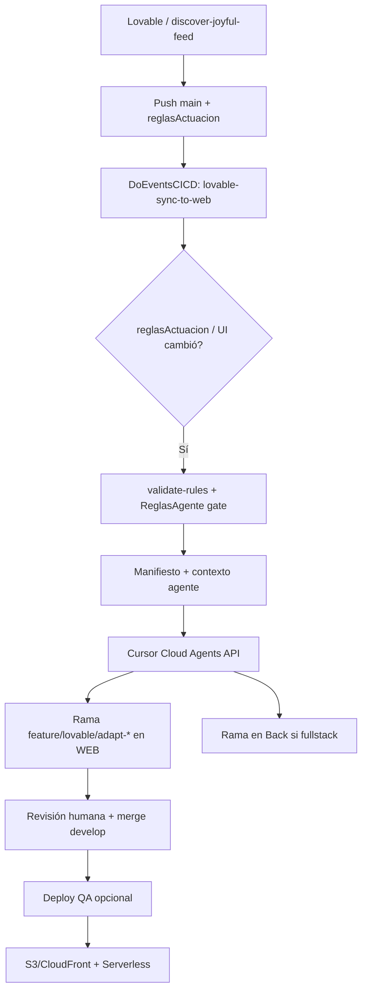

# Arquitectura — DoEventsCICD

Basado en `Automatizacion.html` y `REGLAS_CURSOR_API_LOVABLE_DOEVENTSWEB.md`.

## Flujo principal



## Agentes (patrón Automatizacion §12)

| Agente | Implementación |
|--------|----------------|
| Orchestrator | `lovable-sync-to-web.yml` + scripts Python |
| Rules Interpreter | `validate-rules.py` + `build-agent-context.py` |
| Frontend Agent | `run-port-agent-api.py` + prompt `port-lovable-to-web.md` |
| Backend Impact | `impacto-backend.md` + modo `fullstack` |
| Test / Security | `validate-no-mocks.sh` + `build:qa` en agente |
| Release | `decision-log.md` + PR template |

## Repositorios

| Repo | Rol |
|------|-----|
| discover-joyful-feed | Diseño Lovable + `reglasActuacion/` |
| DoEventsWEB | SPA producción + `ReglasAgente/` + `lovable-bridge/` |
| DoEventsBack | Lambdas serverless |
| DoEventsIA | Asistente `/ai/*` (Cursor runtime, no pipeline sync) |
| **DoEventsCICD** | Scripts, workflows, prompts, políticas |

## Ramas

```text
feature/lovable/*   Cambios diseño
feature/ai/*        Cambios agente Cursor
develop             Integración QA
main                Producción (aprobación manual)
```

## Guardrails

Ver `policies/agent-permissions.yml` y `prompts/REGLAS_CURSOR_API_LOVABLE_DOEVENTSWEB.md`.

- IA no despliega producción
- IA no introduce mocks
- Reglas críticas (pagos, tickets) → RISKY + revisión humana
