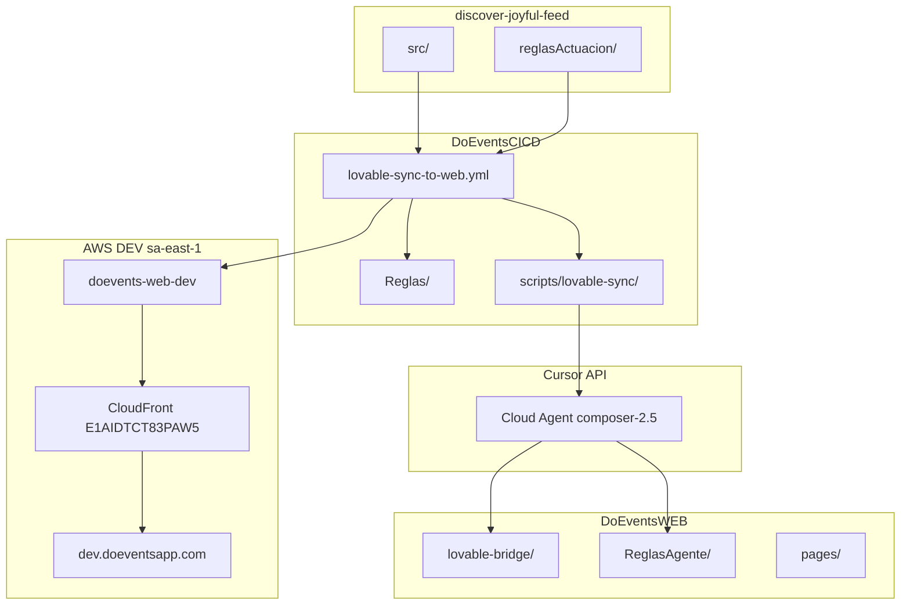

# Arquitectura — DoEventsCICD

Documento de referencia del ecosistema de orquestación **Lovable → Cursor Agent → DoEventsWEB → AWS DEV**.

**Relacionados:** [Manual de configuración](./MANUAL_CONFIGURACION.md) · [Diagramas y especificación](./DIAGRAMAS_SECUENCIA_ESPECIFICACION.md) · [Runbook sync](./runbook-sync.md)

---

## 1. Visión general

DoEventsCICD es el **repositorio de control** del pipeline DEV-only. No contiene la aplicación; orquesta repos, reglas del agente, validaciones y despliegue a **sa-east-1**.

```text
discover-joyful-feed (diseño)
        │
        ▼
DoEventsCICD (orquestación + Reglas/)
        │
        ├──► Cursor Cloud Agents API (empalme, no copy-paste)
        │
        ▼
DoEventsWEB (feature/cicd/dev-automation | feature/lovable/adapt-*)
        │
        ▼
AWS DEV: S3 doevents-web-dev + CloudFront → dev.doeventsapp.com
```

### Principios

| Principio | Implementación |
|-----------|----------------|
| DEV automático | Solo `dev.doeventsapp.com` (sa-east-1) |
| QA manual | Workflows `deploy-*-qa.yml` con confirmación |
| Ramas protegidas | `main`, `develop`, `release` nunca en pipeline auto |
| Empalme | Agente adapta UX; no copia literal de Lovable |
| Sin mocks | Gate `validate-no-mocks.sh` + reglas en `Reglas/` |
| Trazabilidad | `DoEventsWEB/ReglasAgente/` por cada sync |

---

## 2. Repositorios

| Repositorio | GitHub | Rol | Rama pipeline |
|-------------|--------|-----|---------------|
| Diseño Lovable | `doeventsrepo/discover-joyful-feed` | UI + `reglasActuacion/` YAML | `main` |
| Frontend | `doeventsrepo/DoEventsWEB` | SPA monorepo (shell + mfe-auth) | `feature/cicd/dev-automation` |
| Backend | `doeventsrepo/DoEventsBack` | Lambdas serverless | `feature/cicd/dev-automation` |
| IA runtime | `doeventsrepo/DoEventsIA` | Asistente `/ai/*` | `feature/cicd/dev-automation` |
| **CI/CD** | `doeventsrepo/DoEventsCICD` | Workflows, scripts, **Reglas/** | `main` |

Config central: `cicd.config.json`.

---

## 3. Capas de reglas

```text
reglasActuacion/          (discover-joyful-feed)  → Negocio UX en YAML
Reglas/                   (DoEventsCICD)          → Reglamento agente Cursor API
ReglasAgente/             (DoEventsWEB)             → Artefactos por ejecución
```

| Directorio | Contenido |
|------------|-----------|
| `Reglas/operativas/` | Reglamento, prompts empalme/fullstack |
| `Reglas/artefactos-web/` | Plantillas bootstrap → `ReglasAgente/` |
| `Reglas/reglas.config.json` | Rutas y gates |

Ver `Reglas/README.md` y `Reglas/referencia/fuentes-reglas.md`.

---

## 4. Componentes del pipeline

### 4.1 Workflows GitHub Actions

| Workflow | Función |
|----------|---------|
| `lovable-sync-to-web.yml` | Orquestador principal (prepare → adapt → deploy-dev) |
| `deploy-web-dev.yml` | Build `devaws` + S3 + invalidación CloudFront |
| `verify-dev-only.yml` | Guard anti-QA / anti-develop |
| `validate-reglas.yml` | Reusable: valida YAML `reglasActuacion` |
| `ci.yml` | Valida repo CICD + estructura `Reglas/` |

### 4.2 Scripts (`scripts/lovable-sync/`)

| Script | Rol |
|--------|-----|
| `analyze-lovable-diff.py` | Manifiesto de cambios UI/reglas |
| `build-agent-context.py` | Contexto enriquecido para el agente |
| `generate-agent-artifacts.py` | Actualiza `ReglasAgente/` |
| `validate-agent-gate.py` | Bloquea sin `reglas-front.md` ≥ 500 bytes |
| `validate-rules.py` | Esquema YAML Lovable |
| `validate-reglas-cicd.py` | Estructura `Reglas/` |
| `run-port-agent-api.py` | Invoca Cursor Cloud Agents API |
| `validate-no-mocks.sh` | Anti-mock en `pages/` |

### 4.3 Agentes lógicos (patrón orquestación)

| Agente lógico | Implementación |
|---------------|----------------|
| Orchestrator | `lovable-sync-to-web.yml` |
| Rules Interpreter | `validate-rules.py` + `build-agent-context.py` |
| Frontend Agent | `run-port-agent-api.py` + `Reglas/operativas/*` |
| Backend Impact | `impacto-backend.md` + modo `fullstack` |
| Security / QA gate | `validate-no-mocks.sh`, `verify-dev-only.yml` |
| Release | `decision-log.md` + revisión humana |

---

## 5. Infraestructura AWS DEV

| Recurso | Valor |
|---------|-------|
| Región | `sa-east-1` |
| Web | `dev.doeventsapp.com` |
| API | `api-dev.doeventsapp.com` |
| WebSocket | `ws-dev.doeventsapp.com` |
| Bucket S3 | `doevents-web-dev` |
| CloudFront | `E1AIDTCT83PAW5` |
| Build npm | `npm run build:devaws` |
| DynamoDB suffix | `-dev` |
| IAM CI/CD | `cicd-github-dev` (S3 + invalidación CF) |

Scripts infra: `infrastructure/dev-sa-east-1/` (provisionamiento manual).

---

## 6. Flujo de ramas

```text
discover-joyful-feed/main
    → trigger DoEventsCICD
    → prepare en feature/cicd/dev-automation (WEB)
    → [opcional] agente → feature/lovable/adapt-{sha}
    → deploy-dev → dev.doeventsapp.com

PROHIBIDO en automatización:
  develop, main, release, release/*
```

---

## 7. Guardrails y políticas

- `policies/agent-permissions.yml` — rutas permitidas/denegadas al agente
- `.ai-policy.yml` — política adicional del repo
- Environment GitHub **`dev`** — secretos AWS scoped a DEV
- `CURSOR_API_KEY` y `DOEVENTS_WEB_PAT` — nivel repo CICD

Clasificación de cambios del agente:

| Tipo | Descripción |
|------|-------------|
| `VISUAL` | Layout, estilos, copy |
| `FRONTEND_LOGIC` | Validaciones, navegación, estados |
| `BACKEND_REQUIRED` | Falta endpoint/campo persistente |
| `RISKY` | Pagos, tickets, auth — revisión humana |

---

## 8. Estructura del repositorio DoEventsCICD

```text
DoEventsCICD/
├── .github/workflows/
├── Reglas/                    # Fuente de verdad reglas agente
├── scripts/
│   ├── lovable-sync/
│   └── setup-github-secrets-dev.ps1
├── policies/
├── templates/workflows/       # Trigger para discover-joyful-feed
├── docs/                      # Esta documentación
├── cicd.config.json
└── requirements.txt
```

---

## 9. Diagrama de componentes



---

## 10. Estado y evolución

| Fase | Estado |
|------|--------|
| Repo CICD + workflows DEV | Operativo |
| Directorio `Reglas/` | Activo |
| Secretos GitHub environment `dev` | Configurables vía script |
| Trigger automático Lovable | `discover-joyful-feed/trigger-cicd-sync.yml` |
| Agente Cursor en pipeline | Requiere `CURSOR_API_KEY` |
| QA / PROD automático | **Deshabilitado por diseño** |
