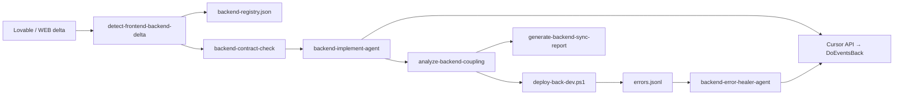

# Backend Sync Framework (BSF) v1.0

Framework portable para sincronizar automáticamente el backend cuando el frontend (Lovable → DoEventsWEB) introduce cambios que afectan contratos API, formularios, validaciones o lógica de negocio.

## Arquitectura de agentes



## Componentes

| Componente | Ruta | Función |
|------------|------|---------|
| Registry | `dsf/backend-registry.json` | Mapeo dominio ↔ lambda ↔ consumidores WEB |
| Delta detector | `scripts/lovable-sync/detect-frontend-backend-delta.py` | Detecta cambios FE con señales de acoplamiento |
| Contract check | `scripts/agents/run-backend-contract-check-agent.py` | Valida endpoints vs contratos |
| Implement agent | `scripts/agents/run-backend-implement-agent.py` | Cursor API → DoEventsBack |
| Error healer | `scripts/agents/run-backend-error-healer-agent.py` | Lee logs y corrige errores |
| Coupling | `scripts/lovable-sync/analyze-backend-coupling.py` | % acoplamiento global |
| Orchestrator | `scripts/agents/run-backend-sync-orchestrator.py` | Pipeline completo BSF |
| Deploy | `scripts/deploy/deploy-back-dev.ps1` | Deploy selectivo lambdas DEV |
| Report | `scripts/lovable-sync/generate-backend-sync-report.py` | Markdown en `Reports/` |
| Logs | `artifacts/{runId}/backend-sync/errors.jsonl` | JSONL estructurado |

## Repositorios y ramas

- **DoEventsCICD** — configuración BSF (`feature/cicd/dev-automation` o `main` para CICD self)
- **DoEventsBack** — lambdas (`feature/cicd/dev-automation`)
- **DoEventsWEB** — frontend empalme
- **discover-joyful-feed** — diseño Lovable

## Modos de ejecución

### Local (dry-run)

```powershell
cd DoEventsCICD
.\scripts\run-backend-sync-dev.ps1 -DryRun -SkipDeploy
```

### Local con deploy

```powershell
.\scripts\run-backend-sync-dev.ps1 -RunId "test-001"
# Requiere AWS CLI configurado y npx serverless
```

### CI — modo fullstack

En `dsf-sync-dev.yml`, usar `agent_mode: fullstack`. Esto dispara `dsf-backend-sync-dev.yml` tras el empalme frontend.

## Porcentaje de acoplamiento

```
overall = 40% campos FE + 40% contratos API + 20% dominios cubiertos
```

Reporte en `Reports/YYYY-MM-DD-backend-sync-{runId}.md`.

## Portabilidad a otras apps

1. Copiar `dsf/backend-registry.json` y adaptar dominios/lambdas.
2. Configurar `cicd.config.json` → sección `bsf`.
3. Ajustar `deploy-back-dev.ps1` según proveedor (AWS/Azure).
4. Mantener `changeSignals` en registry para heurísticas de detección.

## Variables de entorno

| Variable | Uso |
|----------|-----|
| `CURSOR_API_KEY` | Agente implement/healer — **mismo secret** que DSF empalme (`secrets.CURSOR_API_KEY` en GitHub) |
| `BACK_DIR` | Ruta DoEventsBack |
| `BSF_WAIT_CURSOR` | `1` espera fin agente Cursor |
| `DSF_AGENT_DRY_RUN` | `1` sin llamadas reales |

### Local

La clave se carga automáticamente desde `simulation/local.env` (misma que usa `run-dsf-local.ps1`).

### Validación local multiagente

```powershell
cd DoEventsCICD/simulation
python run-multiagent-validation.py
# o: .\run-multiagent-validation.ps1
```

Simula cambios en `CreateEventView`, `ProfileView` y valida orquestador DSF + BSF en dry-run.
