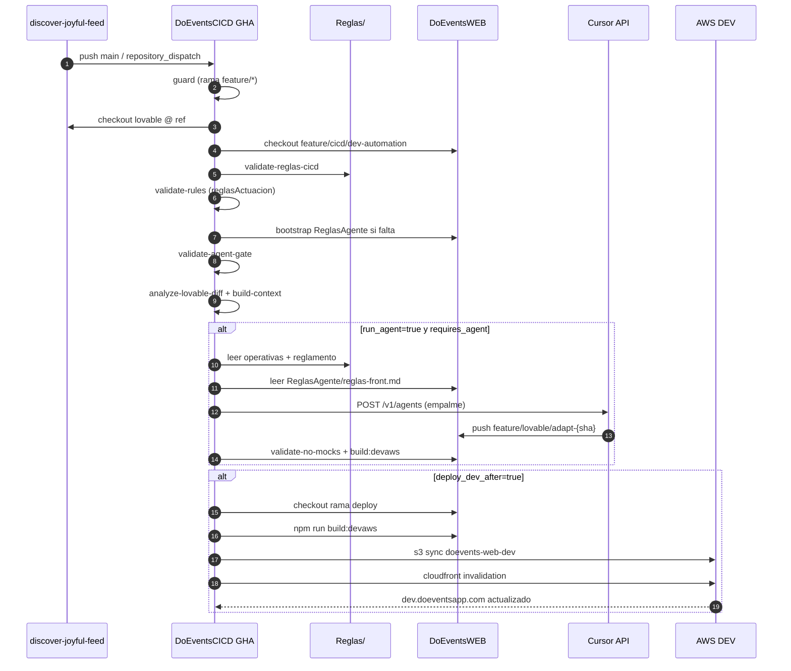
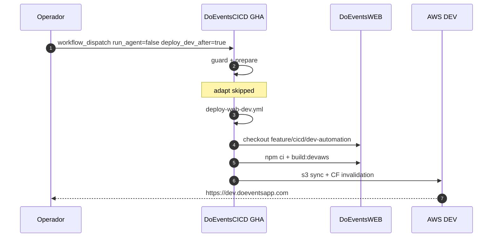
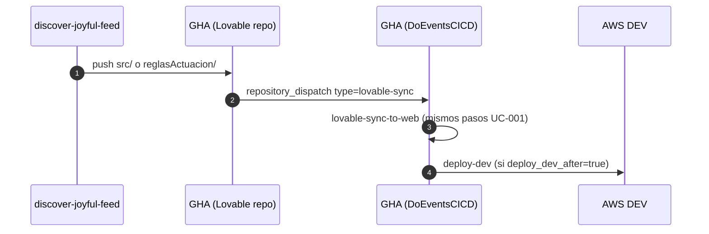
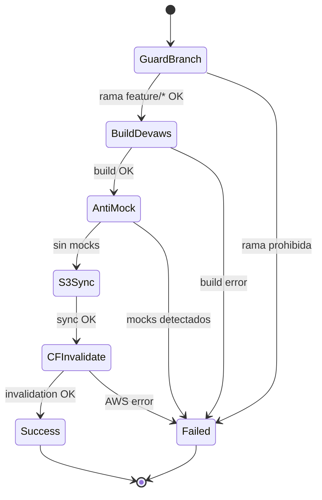

# Diagramas de secuencia y especificación — DoEventsCICD

Especificación funcional del pipeline DEV y diagramas de interacción entre actores.

**Relacionados:** [Arquitectura](./ARQUITECTURA.md) · [Manual configuración](./MANUAL_CONFIGURACION.md)

---

## 1. Actores

| Actor | ID | Descripción |
|-------|-----|-------------|
| Diseñador / Lovable | `DESIGN` | Push UI o reglas a discover-joyful-feed |
| GitHub Actions CICD | `GHA` | Workflows en DoEventsCICD |
| Cursor Cloud Agent | `AGENT` | API `POST /v1/agents` |
| DoEventsWEB | `WEB` | Repo frontend |
| AWS DEV | `AWS` | S3 + CloudFront sa-east-1 |
| Operador humano | `OPS` | Dispara workflows, revisa PRs |

---

## 2. Especificación funcional

### 2.1 Caso de uso: Sync Lovable → DEV

| Campo | Valor |
|-------|-------|
| ID | `UC-SYNC-DEV-001` |
| Disparador | Push Lovable, `workflow_dispatch`, `repository_dispatch` |
| Precondiciones | Secretos configurados; rama `feature/cicd/dev-automation` existe |
| Postcondición | Sitio https://dev.doeventsapp.com refleja build de rama feature |
| Exclusiones | No modifica `develop`, QA ni PROD |

### 2.2 Entradas del workflow `lovable-sync-to-web.yml`

| Input | Tipo | Default | Descripción |
|-------|------|---------|-------------|
| `run_agent` | choice | `true` | Ejecutar Cursor Agent |
| `agent_mode` | choice | `frontend-only` | `fullstack` incluye Back |
| `lovable_ref` | string | `main` | SHA/rama discover-joyful-feed |
| `deploy_dev_after` | choice | `true` | Deploy S3/CF tras prepare/adapt |
| `web_cicd_branch` | string | `feature/cicd/dev-automation` | Rama base WEB (solo `feature/*`) |

### 2.3 Jobs y dependencias

```text
guard → prepare → adapt (opcional) → deploy-dev
```

| Job | Condición skip | Outputs clave |
|-----|----------------|---------------|
| `guard` | Nunca | — |
| `prepare` | Tras guard OK | `lovable_sha`, `web_branch`, `requires_agent` |
| `adapt` | `run_agent=false` o sin cambios | `agent_branch` |
| `deploy-dev` | `deploy_dev_after=false` | — |

### 2.4 Gates de validación

| Gate | Script | Criterio éxito |
|------|--------|----------------|
| Rama feature | bash guard | Prefijo `feature/*`, no protected |
| YAML Lovable | `validate-rules.py` | Archivos parseables en `reglasActuacion/` |
| ReglasAgente | `validate-agent-gate.py` | `reglas-front.md` ≥ 500 bytes |
| Estructura Reglas CICD | `validate-reglas-cicd.py` | 3 operativas + 4 artefactos |
| Anti-mock | `validate-no-mocks.sh` | Sin mocks en `pages/` |
| Build | npm | `npm run build:devaws` exit code 0 |

### 2.5 Payload agente Cursor (especificación)

Generado por `run-port-agent-api.py`:

```text
[Reglas/operativas/prompt-empalme-web.md]
+ [Reglas/operativas/reglamento-cursor-api.md]
+ [CONDICION EMPALME obligatoria]
+ [ReglasAgente/reglas-front.md contenido]
+ [lovable-change-manifest.json]
+ [agent-sync-context.md]
```

API:

```http
POST https://api.cursor.com/v1/agents
Authorization: Basic base64(CURSOR_API_KEY:)
Content-Type: application/json

{
  "prompt": { "text": "..." },
  "model": { "id": "composer-2.5" },
  "repos": [
    { "url": "https://github.com/doeventsrepo/DoEventsWEB", "startingRef": "feature/cicd/dev-automation" }
  ],
  "target": {
    "autoCreatePr": false,
    "branchName": "feature/lovable/adapt-{sha8}"
  }
}
```

### 2.6 Deploy DEV (especificación)

Workflow: `deploy-web-dev.yml`

| Paso | Acción |
|------|--------|
| 1 | Checkout DoEventsWEB `@ web_ref` con `DOEVENTS_WEB_PAT` |
| 2 | `npm ci && npm run build:devaws` |
| 3 | `validate-no-mocks.sh` |
| 4 | `aws s3 sync` shell + mfe-auth → `doevents-web-dev` |
| 5 | Invalidación CloudFront `/*` |
| 6 | URL objetivo: https://dev.doeventsapp.com |

Environment GitHub: **`dev`** (secretos AWS scoped).

---

## 3. Diagrama de secuencia — Sync completo (con agente)



---

## 4. Diagrama de secuencia — Deploy DEV sin agente



---

## 5. Diagrama de secuencia — Trigger automático Lovable



Payload `repository_dispatch`:

```json
{
  "event_type": "lovable-sync",
  "client_payload": {
    "lovable_ref": "<sha>",
    "run_agent": "true",
    "deploy_dev_after": "true",
    "web_cicd_branch": "feature/cicd/dev-automation"
  }
}
```

---

## 6. Diagrama de estados — Job deploy-dev



---

## 7. Contrato de artefactos ReglasAgente

Ubicación runtime: `DoEventsWEB/ReglasAgente/`

### 7.1 `cambios-lovable.json`

```json
{
  "version": "1.0",
  "policy": {
    "noLiteralCopy": true,
    "noLovableMocksInRuntime": true,
    "requireBuildDevaws": true
  },
  "runs": [
    {
      "lovableSha": "abc123...",
      "timestamp": "2026-06-19T12:00:00Z",
      "changeTypes": ["VISUAL"],
      "mocksUsed": false,
      "buildResult": "pass",
      "agentStatus": "APPLIED"
    }
  ]
}
```

### 7.2 `decision-log.md`

Cada entrada debe incluir 7 secciones: resumen, tipo, archivos WEB, archivos Back, evidencia anti-mock, build/test, riesgos.

### 7.3 `impacto-backend.md`

Obligatorio cuando `changeTypes` incluye `BACKEND_REQUIRED`.

---

## 8. Matriz de entornos

| Entorno | Región | Dominio web | Deploy auto | Rama WEB |
|---------|--------|-------------|-------------|----------|
| DEV | sa-east-1 | dev.doeventsapp.com | Sí (pipeline) | `feature/*` |
| QA | us-east-2 | qa.doeventsapp.com | No (manual) | `develop` |
| PROD | us-east-1 | doeventsapp.com | No (aprobación) | `main` |

Config detallada: `envConfig/` en monorepo raíz.

---

## 9. Criterios de aceptación — ejecución DEV

Una ejecución se considera **exitosa** cuando:

1. Workflow `lovable-sync-to-web` o `deploy-web-dev` termina en verde.
2. Job `deploy-dev` completó S3 sync e invalidación CloudFront.
3. `curl -I https://dev.doeventsapp.com` retorna HTTP 200/301/302.
4. Build usó `npm run build:devaws` (no `build:qa`).
5. No hubo push a `develop`, `main` ni `release`.

---

## 10. Referencia de workflows (IDs)

| Archivo | Nombre Actions |
|---------|----------------|
| `.github/workflows/lovable-sync-to-web.yml` | Lovable Sync to WEB (DEV) |
| `.github/workflows/deploy-web-dev.yml` | Deploy WEB DEV |
| `.github/workflows/verify-dev-only.yml` | Verify DEV-only pipeline |
| `.github/workflows/ci.yml` | CI |
